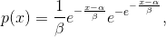
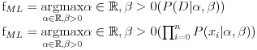
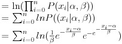
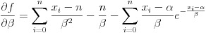
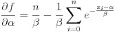
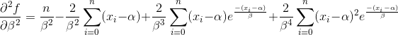
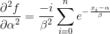
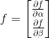
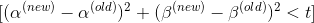
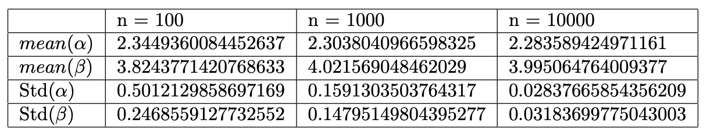

## Maximum Likelihood estimation of Gumbel Distribution

Probability density function of the Gumbel distribution is,

and we’re finding α ∈ R which is the location parameter and β > 0 which is the scale parameter.

We can conclude the following quite easily,

and now calculating log-likelihood.

Now finding derivatives, with respect to both α and β.

We ended up with two multivariate equations, which can not be directly equated to calculate for α and β. There are multiple ways to optimize two or more multivariate equations with, here I’ve chosen to use Newton Raphson method which is an iterative optimization algorithm.

To Optimize using Newton Raphson optimization, we have to calculate derivates, which in our case means double derivates of our initial equations.

Now onto finding the Hessian Matrix, if you do not understand how mutlivariate Newton Raphson work, I'd recommend the these [notes.](http://fourier.eng.hmc.edu/e176/lectures/NM/node21.html) The Hessian matrix in our case will be,

We also need a f matrix with the equations we’re solving for,

Now we have everything that is needed for the algorithm,

**Algorithm:**
**Step 1 :**
We’ll choose starting values for α and β, α(0) and β(0) using the method of moment estimators. 

β = 0.7977∗ standard deviation of the dataset
α = mean of the dataset - 0.4501 * standard deviation

**Step 2 :**

Choose a tolerance t for the change, 10^(−10) in our case. If the level of changes are less than the tolerance the iterations will break.

**Step 3 :**

Obtain inverse of the Hessian Matrix inv(H(α(0))(β(0))) and f(α(0))(β(0))

**Step 4 :**

Obtain new values of α and β, α(new) and β(new), from the Newton Raphson algorithm,

**Step 5 :**

Check to see if the differences between new and the old values are small enough and compare it by the set tolerance,

- if No, then return to Step(3), and calculate H−1(α(new))(β(new)) and f(α(new))(β(new)) and keep iterating.
- if Yes, then stop.

Following are the results of the algorithm for different sized datasets ran multiple times and averaged.

The gumbel distribution was generated using α = 2.3 and β = 4.0

[Direct link to the code.](src/MLE_gumbel.py)